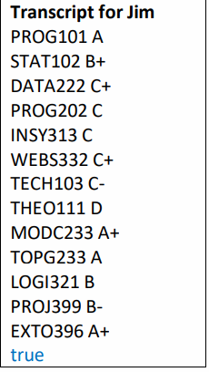

# Am I certified ?- 📜 

As part of one of my OOP early courses, I developed a set of classes to check whether a student is certified or not according to the requierements (given). One of the main goals for this assesment was to traslate from plain Enligh words to Java code. In addition to learn the basics of how Enums work. The entire project icludes a wide range of comments that I used to help me understand what I was doing. 

### Challenges on this project 

The isCertified(Student student) method took some good time to be designed as there was many requirements to consider for a student to be completed certified. 

- The careful implementation of each if statement made a difference on the way  *counts*  where increased. Choosing blocks of  *if* statements vs *else if*  statements played an   important part when determining wherther to certify the student or not outside the *for loop*. It was trade-off between time vs criteria. I learned that having multiple *if*     blocks statments would check every single condition regarless whether is true or false, as oppose to *else if* that exits as soon as a condition is meet. 

  A quick look from the above: 

- Working with Enums was definetly new. Some interesting facts that I found when impleting *Type, Grade, and Level* :
  - The *new* keyword cannot be used to intialise an enum. 
  - Enum constructors must be declared as private.
  - An enum clas is *final* , and this is why it was used to make constants on this project. 
  
### Outputs to the console

- The output for the four different students in class *EvaluateStudents* had to match the requirements, and it almost did.

      vs      

I could  not figure it out how to make it look exactly the same. For example, "A PLUS" to "A+".

### Future plans 

- Something that can be done on this, is to create a small database using SQL to save the data that each student has, and to display it using a GUI. So if you're keen let me     know and we can jump in together!

### Conclusion 
It was a good assesment as it made me think deeper on how to connect my classes, objects, and how to use their methods to archieve a goal. However, not an expert - still learning 😇

